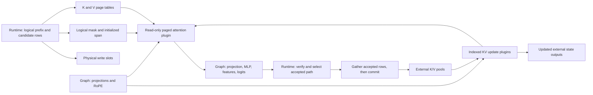

# Indexed KV state and paged attention prototype

This optional backend implements additions A and B from the attention-state
minimal API design through family-owned Python adapters and two TensorRT V3
plugins. It does not modify the installed TensorRT Python/C++ API. The default
`primitives` backend and existing v1 bundles retain native linear KV updates
and explicit graph attention.

The library contains MC's indexed-write kernel, an extracted Edge-LLM XQA
attention kernel, and the original scalar attention fallback. The imported
source is vendored: no Edge-LLM checkout, package, runner or plugin is needed
to build or run MC. Edge-LLM also remains an independent validation reference.
This is not a production paging allocator. The initial model profile remains FP16, batch one, one GPU, greedy
Llama3.1/EAGLE3. The kernel supports padded batches, GQA, boolean masks,
head dimensions up to 256 and logical capacity up to 4096. Packed queries,
quantized KV, additive masks and built-in causal/window modes are not qualified.

## Build selection

```bash
cmake -S . -B build-plugin -G Ninja \
  -DCMAKE_BUILD_TYPE=Release -DCMAKE_CUDA_ARCHITECTURES=100a \
  -DTRTMC_ENABLE_BYOK=OFF -DTRTMC_LLAMA_ATTENTION_STATE_PLUGINS=ON
cmake --build build-plugin --target llama_speculative_validation

PYTHONPATH=core/builder:. python -m tensorrt_model_connect llama build-speculative \
  --model-dir /models/Llama-3.1-8B-Instruct \
  --draft-dir /models/EAGLE3-LLaMA3.1-Instruct-8B \
  --attention-backend plugin --kv-page-size 64 \
  --attention-plugin-library build-plugin/libtrtmc_llama_attention_state.so \
  --max-sequence-length 2048 --max-query 64 --draft-depth 4 \
  --output /models/llama-eagle3-paged.bundle
```

The CMake option builds/links the standalone library. The bundle build flag
chooses the graph lowering; it is not a per-token runtime dispatch. Deploy the
matching library beside the Llama family runtime. Plugin registration occurs
before engine deserialization. A runtime built without the option rejects a
plugin bundle with an explicit error. The default build does not link the
plugin library. Ordinary model operations, including projections, norms,
RoPE, MLPs, feature concatenation, logits and mask composition, remain graph ops.

With plugins enabled, `TRTMC_LLAMA_EDGE_XQA=ON` (the default) compiles the
extracted XQA kernel for FP16, head dimension 128, page size 64 and at most 64
query rows. Its aligned tensor-core path covers chunked prefill, ordinary
decode, chain and tree verification. Other geometries or unaligned buffers
use the scalar implementation. Set `TRTMC_LLAMA_EDGE_XQA=OFF` to build the
original scalar plugin. The `primitives` backend is unchanged.

Only attention was extracted: profiling showed that indexed writes were less
than 1% of baseline GPU kernel time. See the [source provenance and adaptation
notes](runtime/attention_state/edge_xqa/README.md). The plugin creator/version,
serialized fields, tensor bindings, required workspace and state ABI remain
unchanged; existing v2 plugin bundles can use the new library.

## API and effects

`AttentionStateGraph.add_kv_cache_update(cache, update, write_indices,
KVCacheMode.INDEXED)` has the proposed addition-A signature. Pools have layout
`[G,Hkv,P,D]`; updates are `[B,Hkv,Q,D]`; slots are INT32 `[B,Q]`.
Slot `s` writes `pool[s//P,:,s%P,:]`. `-1` skips the row. Active slots must be
unique, in bounds and exclusively owned. The checked MC state adapter generates
these slots; the kernel bounds checks do not replace those preconditions.
Unwritten bytes remain unchanged. A write changes bytes, not accepted length.
K and V are independent resources with independent slot operands.

`add_attention_v2(scaled_q, k_present, v_present, SOFTMAX, NONE)` returns an
adapter exposing `set_key_value_page_tables(key_pages, value_pages)` and the
matching getters. The setter requires both tables or neither; null/null uses
dense BHND interpretation. `key_value_lengths` and `mask` are existing-style
tensor properties. Query scaling and RoPE occur in the graph before the plugin.
Configuration precedes `get_output(0)`, which materializes the V3 node.

Paged lookup for logical key `j` is
`pool[table[b,j//P],h,j%P,d]`. K/V table entries are physical page IDs;
mask columns and positions are logical. Length bounds logical participation
and the pages that may be resolved. A tiled kernel may read allocated tail
slots within the last mapped page, but those slots must not affect the result.
Unused page-table entries may be `-1`. Invisible rows must not
affect the result, even when they contain stale NaNs; empty attention rows
return zero. The scalar path skips those rows. XQA uses tiled loads and a
scalar repair for non-finite outputs, preserving that observable behavior
without requiring runtime cache clearing.

Query/key products accumulate in FP32 and scores round to FP16. XQA uses
online softmax with FP16 unnormalized weights and FP32 accumulation; the
scalar/primitive paths round normalized probabilities to FP16. Final outputs
are FP16. The contract requires numerical agreement within the established
attention tolerance, not identical internal softmax rounding or bitwise
logits. Cache bytes, page lookup, visibility, lengths and aliasing remain
exact requirements. Any future OOTB lowering must satisfy those same checks.



## Compiler/runtime state ABI v2

The bundle container remains version 1; its engine contracts use version 2.
Model inputs/outputs and EAGLE3 feature alignment are unchanged from
[the v1 contract](SPECULATIVE_DECODING.md). These state bindings replace the
v1 linear cache/write-start bindings:

| Binding | Type and shape | Meaning |
| --- | --- | --- |
| `cache_k_i`, `cache_v_i` | FP16 `[G,Hkv,P,D]` | Runtime-owned pools; `G=C/P`. |
| `present_k_i`, `present_v_i` | Same | Post-update version of the same allocation. |
| `key_write_slots`, `value_write_slots` | INT32 `[1,Q]` | Physical destinations for query rows. |
| `key_pages`, `value_pages` | INT32 `[1,G]` | Logical-page to physical-page mappings. |
| `key_value_lengths` | INT32 `[1]` | Initialized logical span, including tentative rows. |
| `attention_mask` | INT32 `[Q,C]`, cast to BOOL in graph | Complete prefix/self/ancestor visibility. |
| `position_id` | INT32 `[Q]` | Logical RoPE positions; independent of slots and page IDs. |

The manifest explicitly records `pages_heads_slots_dim`, `aliased_indexed_write`,
`page_size`, `attention_backend=plugin`, and the alias qualification below.
The runtime checks names, types, shapes, profiles and supported geometry.

State ownership is deliberately separate from EAGLE3 policy:

- `StateLayout` maps logical rows to pool addresses. It reserves all pages per
  engine; K pages are reversed and V pages are ascending to exercise different
  mappings. It does not implement dynamic allocation, eviction or sharing.
- `Engine` owns target or draft pools, allocation lifetime, invocation metadata,
  stream sequencing and accepted-path copies. Each resource has one graph writer;
  attention consumes the updated tensor. No old-version reader is permitted.
- `Pipeline`/`Eagle3` own committed length, pending token, proposed tree, acceptance
  and conditioning. Verification initializes tentative rows; accepted length
  advances only after policy selects and commits a path.
- Commit first gathers all selected logical rows to scratch, then scatters them
  into the new prefix through each pool's map. Page crossings and overlapping
  source/destination rows therefore preserve the selected path. Reset hides stale
  rows through subsequent lengths/masks; no full-pool clearing is necessary.

## Alias qualification and the route to native lowering

Current TensorRT's `getAliasedInput` is a plugin-local mutation declaration; it
can permit compiler-inserted copies. It is not the proposed strict
`requireOutputAlias` engine-boundary API. The prototype does not pretend that
binding equal pointers establishes the compiler's state semantics.

The update plugin declares input 0/output 0 aliasing through
`IPluginV3OneBuildV2`, with the required preview feature. The family runtime
registers its original allocations and binds each cache pair to its allocation.
Every deserialized update plugin checks that its actual input and output are
identical and refer to a registered allocation of exactly the expected size.
A reformat/private cache copy fails execution instead of silently changing the
state ABI. Registration has runtime-owned RAII lifetime. Registration is not
required during builder profiling, whose temporary tensors are not model state.

This is recorded as `plugin_local_alias_runtime_identity_guard`. It is an
experimental execution-time check, **not** a build-time portability guarantee
or native engine alias metadata. Such an engine may build successfully and be
rejected when first invoked. A future TensorRT `requireOutputAlias` implementation
should replace this bridge and expose the alias through engine introspection.
The native v1 path continues to require TensorRT's engine-declared aliases.

Replacing paged attention with an OOTB implementation needs matching logical
page lookup, visibility, lengths, numerical behavior and FP16 pool layout.
Replacing indexed updates additionally needs native indexed writes and strict
external aliasing. Graph construction can then change its lowering while keeping
v2 tensor/state semantics; update the manifest's backend/alias qualification only
after that implementation is supported and checked. Allocator policy, EAGLE3
acceptance, positions and feature exchange need no kernel-specific changes.

The adapter validates the single-writer restriction before compilation: every
cache input has exactly one consumer (its update), and every updated tensor is
a marked output. Additional old-state readers are rejected. Source/update
storage overlap is also rejected by the plugin before launching its write.

## Validation

Run the small GPU probe before compiling model weights:

```bash
PYTHONPATH=core/builder:. python -m families.llama.tests.attention_state_gpu \
  build-plugin/libtrtmc_llama_attention_state.so
build-plugin/families/llama/test_llama_speculative_policy
build-plugin/families/llama/llama_speculative_validation MODEL_BUNDLE INPUT_IDS_JSON 101 OUTPUT_JSON
```

The probe checks exact updated/untouched cache bytes, skipped rows, cross-page
writes, separate K/V maps, GQA, logical masks/lengths, empty rows and stale NaNs.
The full-model criterion is a 1024-ID prompt followed by 101 output IDs (the
prefill prediction plus 100 autoregressive decode calls), comparing MC
autoregressive/chain/tree and independent Edge-LLM autoregressive/EAGLE3.
Recorded results belong to their specific backend and run; the earlier native
pass is not evidence that this new plugin path has passed.

On September 21, 2026, GB100/SM100 with TensorRT 11.1.0.106, CUDA 13.3 and
driver 595.58.03 passed the full criterion for **both** backends. Each MC
autoregressive/chain/tree stream matched the fresh Edge-LLM autoregressive and
EAGLE3 streams for all 101 IDs. Both MC reset checks passed; tree verification
used 25 rounds. The plugin probe returned exact cache bytes and zero attention
error for its small fixture. The ownership guard rejected an unregistered
allocation. Engine alias introspection returned null for the plugin cache
outputs, confirming the need for the explicit alias qualification.

The reference uses Edge-LLM revision
`e8b29522938901f6df19ebeedd4b69bc8edbcd97` and the same pinned target/draft
checkpoints and raw-ID fixture as the earlier native validation. That Edge
revision maps the checkpoint's llama3 RoPE scaling to default RoPE, whereas MC
retains the trained scaling. Passing greedy IDs on this fixture therefore does
not establish general long-context or tensorwise-logit equivalence.
