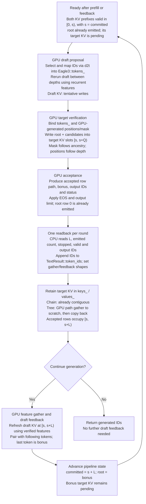

# Llama speculative decoding design

Scope: FP16 Llama 3.1 8B Instruct with its EAGLE3 draft, one request on one GPU,
greedy chain/tree verification and fixed-capacity linear KV state. Attention
uses TensorRT graph primitives; paging and sampled speculation are not implemented.

## Separation of responsibilities

The compiler/runtime contract includes model I/O, state effects and execution
constraints. KV is persistent mutable state; target/draft features are ordinary
model I/O with explicit alignment and lifetime.

[Engine](runtime/speculative/engine.h) owns bindings, state storage and accepted-row
copies. [EAGLE3](runtime/speculative/eagle3.h) owns conditioning, proposals,
verification, acceptance and feedback; the pipeline owns request progress. Another method
can reuse the engine contract if its state and I/O semantics fit. The contract
does not require token-by-token drafting or claim to cover recurrent-state models.

## Shorthand and layout

These symbols describe dimensions and indices, not additional tensor bindings.

| Symbol | Meaning |
|---|---|
| `B` | Batch size; fixed to 1 in this prototype. |
| `Hkv`, `D` | Number of KV heads and elements per head. |
| `Q`, `M` | Query rows in one invocation and rows selected for logits. |
| `C` | Allocated token-slot capacity per layer/cache, set by `--max-sequence-length`; includes committed and tentative rows, not the current valid length. |
| `V` | Vocabulary size of the engine producing logits. |
| `s`, `r`, `i` | Physical write-start slot, invocation-local query row and decoder-layer index. |

The native KV layout `[1,Hkv,C,D]` follows `[B,N,S,H]`: batch, heads, sequence,
head dimension. Here `N=Hkv`, `S=C`, `H=D`; `H` is per-head width, not model hidden
width. The existing Llama [builder](dual_profile_decoder_builder.py) uses this
4D layout for native KV but `[cache_rows,Hkv*D]` for its dense-mask path.

## Engine ABI v1

[EngineContract](speculative/contract.py) is serialized per target/draft engine in
`speculative.json`. Bindings are dense, contiguous device tensors. Tensor names,
row order and alias requirements are part of the ABI.

| Binding | Type/shape | Semantics |
|---|---|---|
| `token_id` | input INT32 `[Q]` | Target-vocabulary IDs, including for draft embedding lookup. |
| `position_id` | input INT32 `[Q]` | Logical RoPE positions; siblings share a position even in different physical slots. |
| `cache_write_indices` | input INT32 `[1]` | Start `s`; query row `r` writes physical slot `s+r`. |
| `key_value_lengths` | input INT32 `[1]` | Initialized span `s+Q`, including tentative rows; not accepted length. |
| `attention_mask` | input INT32 `[Q,C]` | 1=visible, 0=hidden. Committed prefix plus inclusive ancestors for each query. |
| `logits_indices` | input INT32 `[M]` | Query rows selected for final norm and LM head, in requested order. |
| `cache_k_i`, `cache_v_i` | input FP16 `[1,Hkv,C,D]` | Runtime-owned layer state; cached K has already undergone RoPE. |
| `present_k_i`, `present_v_i` | output FP16 `[1,Hkv,C,D]` | Alias corresponding cache inputs; only slots `[s,s+Q)` change. |
| `logits` | output FP32 `[M,V]` | Raw logits predicting the token after each selected query row under its visible history. |
| `features` (target) | output FP16 `[Q,12288]` | Concatenated inputs to layers 2, 16, 29, before their norms, in query-row order. |
| `target_features` (draft) | input FP16 `[Q,12288]` | Verified preceding-token target features; zero during recurrent drafting. |
| `draft_features` (draft) | input FP16 `[Q,4096]` | Previous draft residual; zero when conditioning on target features. |
| `features` (draft) | output FP16 `[Q,4096]` | Unnormalized draft residual, in query-row order. |

The target vocabulary has 128256 entries; the draft has 32000. Draft output
indices must pass through the checkpoint's `d2t` mapping before becoming target
token IDs. Both draft conditioning inputs have `Q` rows. Each invocation requires
`1 <= M <= Q`, `s >= 0` and `s+Q <= C`, within its declared profile bounds.

Feature taps use zero-based layer **inputs**: the default final tap is layer
`L-3`, equivalent to `hidden_states[-4]` in a full Hugging Face tuple of `L+1`
states. A draft's `eagle_aux_hidden_state_layer_ids` overrides the three taps
and their concatenation order. The builder records the same indices in
`speculative.json` and compiles them into the target; changing them requires
rebuilding the bundle.

The runtime generates `position_id`: on the CPU for prefill/AR and through GPU
policy graphs for speculation. A root's position is `s` and each child's position
is its parent's plus one; the model graph consumes these values for RoPE. Ordinary Llama decoding uses
`LlamaKvCache::write_position_input` to generate `position_ + r`. Positions are
therefore sequential for chains, but siblings share a position in trees.

### State effects and ownership

- The graph must declare KV mutation and required input/output aliases.
  The manifest describes those effects; it cannot establish them. Binding
  unrelated tensors to the same address is insufficient: the runtime checks
  TensorRT's engine alias metadata.
- Writes materialize tentative rows without committing them. Logical token
  positions, initialized physical span and accepted length are distinct.
  Attention combines declared visibility with the initialized span; inactive
  cache rows are sanitized before matmuls to prevent stale NaN contamination.
- Accepting a tree path can select noncontiguous rows. Gather the entire path
  to scratch before copying it into the committed prefix, so overlapping
  sources and destinations cannot corrupt state.
- Rejected rows and reset state become inaccessible through lengths/masks.
  Their bytes need not be cleared; subsequent writes may overwrite them.

## Runtime cache state

The speculative runtime owns two independent sets of per-layer K/V allocations,
one per engine. Request progress belongs to the pipeline, not to those tensors.

| State | Owner and meaning |
|---|---|
| K/V buffers | Each `Engine` owns `keys_`/`values_`, retained across calls and requests. Prefill/decode contexts bind the same allocations. |
| Committed length | Request-local `committed` in `Pipeline::generate_ids`; accepted prefix length and target verification's next write start. `Engine` has no accepted-length counter. |
| Pending root | GPU `Eagle3::root_` after acceptance; an emitted token whose target KV is not yet committed. The pipeline retains its CPU ID for request progress. Shifted draft conditioning is prepared before the next round. |
| Proposal IDs and ancestry | GPU `Eagle3::tokens_` and topology constants compiled into policy plans. Row zero is the pending root. |
| Accepted path | GPU acceptance-plan output `path`, padded to the proposal depth; only its first `path_length` rows are valid for KV/feature gathers. |
| Generated IDs | GPU acceptance-plan output `tokens_out`, copied into CPU `TextResult::token_ids` once per round with compact status. Token IDs are separate from KV storage. |
| Tentative span | Per-call `[s,s+Q)` writes. `key_value_lengths=s+Q` bounds the initialized span; positions and masks are regenerated for each call. It does not commit any token. |

At target verification, `s=committed`: `[0,s)` is the accepted prefix and
`[s,s+Q)` contains the root and candidate rows. Retaining a path commits the root
plus accepted candidates; draft feedback then catches up before the next round.
Rejected rows remain physically present but invisible. Reset preserves allocation
contents; a new request prefills from slot zero and reconstructs progress and
visibility rather than clearing KV bytes.

## EAGLE3 alignment and transitions

Target prefill emits a root whose target KV is still pending. If generation
continues, draft prefill pairs `prompt[1:] + root` with the unshifted target
features at draft positions `0..prompt_length-1`.

The diagram shows one round, starting at `s=committed`. `Q` includes the root
and all proposed rows; `L=path_length` includes the root and accepted candidates.
Target and draft each own independent GPU `keys_` / `values_` buffers.



Target commit copies within the target cache; it never copies draft KV into
target KV. Rejected rows become invisible, without clearing their bytes. Draft
feedback instead recomputes state: feature `F_i` pairs with token `x_(i+1)` at
draft position `i`. Target and draft valid prefix lengths advance together
despite this conditioning offset. Only evaluated inputs materialize KV;
selecting or emitting a token ID does not.

For example, accepting a second-choice leaf requires target compaction and
shifted draft feedback (`Z` is the target prediction after `A2`):

```text
GPU proposal IDs = [root, A, B, A1, A2]
compiled parents= [  -1, 0, 0,  1,  1]
accepted path    = [0, 1, 4]                 # root -> A -> A2
target KV slots: [s, s+1, s+4] -> [s, s+1, s+2]
draft feedback:  (F_root, A), (F_A, A2), (F_A2, Z)
next round:      committed = s+3, root = Z   # Z emitted, target KV pending
```

The implemented tree expands the best branch and exposes a second-choice sibling
at each depth; it is not a full beam-search policy. A future target-prefix cache
hit must also restore or reconstruct compatible draft/feature state.

### Device policy

Every EAGLE3 bundle includes family-owned TensorRT selection and policy plans.
`speculative.json.device_policy.version=1` identifies their contract; older
bundles without these plans require rebuilding. There is no host-policy fallback.
The attention/KV ABI remains independent of these stateless helper plans.

Acceptance returns INT32 `status[4] = [path_length, emitted_count, stopped, valid]`
and padded `path`/`tokens_out` arrays of `depth+1` entries. Read back only status
and output IDs; append the first `emitted_count` IDs and use `path_length` for
device gathers. When continuing, `tokens_out` also supplies the shifted draft
feedback tokens, ending with the bonus. Reject a round when `valid != 1`.

The device path uses explicit stream events instead of blocking between draft
steps. `DeviceStep` borrows selection/features with a completion stream; consumers
must finish reading before the producer overwrites them. Scratch/start buffers
are also ordered against the previous feedback and target commit before reuse.
Token IDs and metadata bind directly to device buffers; subsequent prefill/AR
calls restore owned inputs large enough for that engine's maximum query.
Acceptance emits a padded path; only its first `path_length` rows may be gathered
or committed. The host sets dynamic feedback/gather shapes from that length.
GPU computation uses TensorRT graph primitives, including the separate KV gather;
there are no custom policy or attention kernels.

## Execution and value lifetimes

`execution_profiles` records phase and query/logit MIN/OPT/MAX bounds in engine
profile order: 0=prefill, 1=decode. Missing/empty metadata means one shared profile.
Select by phase, not row count: a one-row prefill still uses the prefill context.
Both contexts share KV allocations and stream ordering; changing phase preserves
state. Target and draft have separate KV storage.

`Engine::run` returns completed borrowed device feature views, valid only until
the producer's next invocation, reset or destruction. Stage draft inputs before
reusing producer outputs. Accumulate prompt features in independently owned
storage across prefill chunks and complete target-stream copies before draft
prefill. The runtime owns KV/staging/compaction buffers; TensorRT owns workspace.

### Greedy selector

`target_selection.plan` and `draft_selection.plan` are required stateless graphs
that consume existing model outputs without changing the attention/KV ABI.

| Binding | Type/shape | Semantics |
|---|---|---|
| `logits` | input FP32 `[M,V]` | Borrowed model logits in selected-query order. |
| `selection` (target) | output INT32 `[M,2]` | Best vocabulary index, all-finite flag. |
| `selection` (draft) | output INT32 `[M,3]` | Best and second-best distinct indices, all-finite flag. |

Ranks sort by descending value, breaking ties by lowest index, including signed
zero. NaN or either infinity invalidates the row; IDs on invalid rows are
unspecified. Reject invalid rows when consumed by the policy, not merely because
an unvisited branch contains them. Indices remain in each model's vocabulary.

The selector waits on the model-completion event before reading device logits.
Prefill/AR synchronizes and reads compact selections; speculative calls pass
borrowed device outputs onward with completion events. This is a greedy-decision interface;
sampled methods may require full distributions and a different selector contract.

## Changing the lowering or state representation

[Graph.attention()](speculative/graph.py) is the lowering boundary. Replacing its
attention primitives with `IAttention` can retain native linear KV updates and the
existing runtime ABI. Preserve Q scaling, RoPE, GQA, tree visibility, inactive-row
handling, cache aliases, row ordering and numerical qualification. This native
attention replacement is not yet qualified; an API change alone promises no
particular fused kernel or speedup.

Changing external cache layout, dtype, mask encoding or alias semantics requires
a new ABI or explicit adapter. Paging is independent of proposal policy, but
must declare pool geometry, logical-to-physical read/write mappings, partial-page
validity, shared-page ownership and in-flight lifetime. Shared tails require
copy-on-write or private tentative storage; page remapping cannot in general
replace compaction of arbitrary rows within a page. Allocation and reclamation
remain runtime responsibilities.

[Validation](tests/cpp/speculative_validation.cpp) checks AR/chain/tree output
consistency, reset and short prompts. The 1024-input fixture with 101 output IDs
includes one prefill prediction and 100 autoregressive decode calls. Agreement
on that repeated fixture does not establish general model quality or long-context
accuracy.
