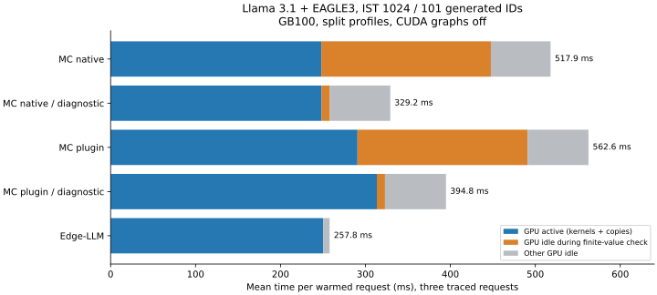

# Llama / EAGLE3 graph and runtime profile

The largest MC-versus-Edge latency difference on this fixture is CPU runtime
work between engine calls. Native MC and Edge have approximately the same
GPU-active time per request. The standalone XQA plugin adds a separate GPU
cost, concentrated in target verification attention.

This profiles the split-profile, 1024-token-prefill bundles from the
[execution-profile experiment](SPECULATIVE_PROFILES_PERFORMANCE.md), using
Nsight Systems CUDA/NVTX traces on September 22, 2026. No engines were rebuilt.
Baseline captures use the production runtime plus instrumentation. An isolated
diagnostic confirms the largest CPU bottleneck without removing validation.
The subsequent [host-runtime follow-up](SPECULATIVE_HOST_RUNTIME.md) lands the
allocation fix and describes the next device-residency work.

## Request decomposition

GB100/SM100, FP16 Llama-3.1-8B-Instruct + EAGLE3, B1/TP1, IST=1024,
101 generated IDs, greedy chain, draft depth four, KV capacity 2048,
CUDA graphs disabled for all backends. Every measurement includes request
reset, target/draft prefill, decode, acceptance, transfers and output conversion.
Loading and warm-up are excluded.

| Backend | Untraced median, ms | Traced mean, ms | GPU active, ms | GPU idle, ms | Kernel launches/request |
|---|---:|---:|---:|---:|---:|
| MC native primitives | 512.27 | 517.94 | 248.08 | 269.86 | 15,699 |
| MC XQA plugin | 565.70 | 562.58 | 290.66 | 271.92 | 15,143 |
| Edge-LLM | 251.96 | 257.82 | 250.28 | 7.54 | 12,063 |

Untraced medians use ten requests after three warm-ups. Trace means use three
requests after three separate warm-ups. GPU active is the union of all kernel,
memcpy and memset intervals inside each request; idle is its complement.
The last two time columns therefore sum to traced request time. This measures
activity on the timeline, not SM occupancy. Concurrent kernels are counted once.



The native traced gap is 260.12 ms: GPU activity differs by -2.19 ms, while
idle time differs by +262.32 ms. For the plugin, the 304.77 ms gap consists of
+40.38 ms of GPU activity and +264.38 ms idle. These are timeline decompositions,
not estimates obtained by adding nested CPU timers.

## Confirmed CPU bottleneck

In [argmax](runtime/speculative/engine.cpp), the finite-value scan calls:

```cpp
require(std::isfinite(values[index]), "non-finite logits");
```

`require` accepts `const std::string&`. The 17-character message constructs a
temporary string for every logit, including valid logits. Disassembly of the
measured Release binary shows `_M_create` and `operator delete` in that loop.
Each request performs 128 target argmax calls over 128,256 logits and 100 draft
calls over 32,000 logits: **19,616,768 temporary strings**.

The finite scan occupies 199.60 ms/request in native MC and 200.19 ms in the
plugin, entirely while the GPU is idle. The subsequent `std::max_element`
scan adds approximately 19.7 ms. Acceptance and proposal NVTX ranges contain
these scans; their inclusive times must not be added again.

The diagnostic changes only the call placement:

```cpp
if (!std::isfinite(values[index]))
    require(false, "non-finite logits");
```

The same finite-value validation, exception, argmax and speculative policy
remain. Engines, weights, masks, cache handling and GPU kernels are unchanged.

| Measurement | Native baseline | Native diagnostic | Plugin baseline | Plugin diagnostic |
|---|---:|---:|---:|---:|
| Untraced request median, ms | 512.27 | **336.78** | 565.70 | **378.53** |
| Finite scan, traced ms | 199.60 | **9.66** | 200.19 | **9.57** |
| GPU idle, traced ms | 269.86 | **80.82** | 271.92 | **81.39** |
| GPU active, traced ms | 248.08 | 248.42 | 290.66 | 313.44 |

Request medians improve by 34.3% and 33.1%. The native trace isolates the effect
particularly clearly: approximately 190 ms less finite-scan time and unchanged
GPU work. Plugin GPU execution was slower in its later diagnostic capture;
the measured 190.54 ms reduction in idle time is more useful for attributing
this CPU change than its total traced speedup. Clocks were not locked.

These diagnostic measurements preceded the production fix. Their source is
retained in the profiling artifacts; see the host-runtime follow-up for the
later implementation and its separate validation.

## What differs in the GPU graph

GPU kernel intervals below are attributed to the phase that launched them,
using CUDA API correlation IDs and the enclosing NVTX range. Values are unions
within each phase, not CPU stage durations. Edge enqueues several stages
asynchronously, so its CPU stage durations are not engine execution times.

| Phase: GPU kernel-active ms/request | MC native | MC plugin | Edge |
|---|---:|---:|---:|
| Target prefill | 36.71 | 38.95 | 34.94 |
| Target verification, all rounds | 161.91 | 198.82 | 157.96 |
| Draft prefill | 1.70 | 1.77 | 1.74 |
| Draft proposal | 27.08 | 28.91 | 42.50 |
| Draft feedback/accept | 10.17 | 11.03 | 12.75 |

MC executes 26 target-verification rounds and Edge executes 25 for the same
101 IDs. Normalized target-verification GPU time is 6.23 ms/call native,
7.65 ms/call plugin and 6.32 ms/call Edge. These are actual workload comparisons;
draft proposal/feedback implementations and final partial rounds differ.

Native uses 511 kernel launches per target-verification call, plugin 483 and
Edge 333. More launches do not imply slower GPU execution here: native's
verification time per call is comparable to Edge's. Summed kernel durations
overstate elapsed work when kernels overlap: Edge's sum is 287.25 ms/request
but its kernel interval union is 249.90 ms; native's corresponding values are
242.55 and 237.57 ms. The trace establishes overlap, without assuming its cause.

### Attention and KV updates

These are **summed kernel durations** to compare named operations. Native
attention comprises the NVTX-labeled QK matmul, masked softmax and PV matmul.
The table excludes native cache sanitization/update, RoPE and surrounding
reformats; plugin and Edge attention columns also exclude their surrounding
update/RoPE kernels. They are not complete attention-layer timings.

| Target operation, ms/request | MC native | MC plugin | Edge |
|---|---:|---:|---:|
| Prefill attention core, 32 layers | 8.15 | 9.10 | **1.16** |
| Verification attention core | **14.19** | 44.97 | 21.48 |
| Separate indexed K/V write kernels | Fused into graph work | 4.49 | Included in other fused operations |

Native verification attention consists of 4.25 ms QK, 4.30 ms masked softmax
and 5.64 ms PV. The plugin's extra target-verification GPU time versus native
is 36.91 ms; the 30.78 ms attention-core difference is its largest identified
component. Plugin indexed writes and different surrounding tactics also matter.

MC and Edge both launch verification XQA with `grid=(1,8,1)` and
`block=(128,1,2)` on this fixture. MC takes 54.05 microseconds/launch across
832 launches; Edge takes 26.85 microseconds across 800. Thus an eight-block
launch alone does not explain their difference. MC's
[adapted XQA](runtime/attention_state/edge_xqa/README.md) implements independent
K/V page maps, full BOOL visibility over the cache, FP16 score rounding,
page validation and non-finite output detection/repair. Edge's donor path uses
its own packed speculative visibility and cache contract. These are concrete
differences to investigate; this trace does **not** isolate the cost of each
adapter or establish that scalar repair executed.

For prefill, Edge uses a Blackwell fused multi-head attention kernel. MC's
plugin uses the multi-query XQA specialization. Native materializes the score
and softmax computations; its prefill softmax alone costs 5.50 ms. A dedicated
prefill attention lowering is a clear GPU optimization opportunity, although
whole target-prefill GPU time differs by only 1.76 ms native versus Edge because
other graph operations and tactics differ too.

### GEMMs and other graph work

GEMMs remain the largest GPU category. During target verification their summed
time, excluding native QK/PV attention matmuls, is 129.76 ms native, 134.59 ms
plugin and 145.00 ms Edge. Native/plugin include Myelin fused dual-GEMM kernels
(75.15/80.40 ms); Edge uses a different set of CUTLASS GEMMs. The existing plans
also differ in accumulation tactics. This profile does not justify replacing
MC's GEMMs wholesale with Edge's choices.

Native's verification graph has 14.91 ms of other Myelin kernels, including
cache visibility, transposes and other fused operations, plus 6.96 ms of
normalization-named kernels. Kernel names and selected NVTX labels identify
these groups, but do not reliably separate every fused operation into a source
graph node. Raw per-kernel and per-phase tables preserve that distinction.

## Remaining runtime work

MC still returns all selected logits and target/draft feature rows to pageable
CPU vectors on every engine call, then uploads conditioning features for the
next draft call. Native performs 127 engine calls/request, 254 D2H copies and
962 H2D copies: **116.02 MB D2H and 58.47 MB H2D**. Plugin transfers essentially
the same bytes with additional page/slot metadata copies. Edge transfers
704 bytes D2H and 8,844 bytes H2D in the captured request; it keeps logits,
selection and model-to-model feature handling on the GPU. Byte units here are
decimal, and these counts exclude internal kernel memory traffic.

Actual GPU copy time is 10.51 ms native and 11.19 ms plugin, versus 0.38 ms for
Edge copies plus memset. The much larger native `cudaMemcpyAsync` **CPU API**
time (193.36 ms) includes waiting for preceding GPU work on pageable readback;
it is not 193 ms of PCIe transfer and cannot be added to GPU execution time.

After the diagnostic, native still has 80.82 ms of GPU idle time: 9.66 ms finite
scan, 19.78 ms max-element scan, and approximately 51 ms in other runtime work.
The engine ranges expose mask/input preparation, enqueue/staging and readback
overheads; additional host feature copies and allocations occur outside those
ranges. This capture does not individually attribute every remaining CPU gap.
Chain mode makes no explicit `Engine::commit` calls, so tree cache-compaction
cost is not a bottleneck demonstrated by this experiment.

Implementation order identified by this profile (the host-runtime follow-up
implements step 1):

1. Remove the per-logit temporary-string construction while preserving finite
   validation. This is the directly confirmed, lowest-scope improvement.
2. Keep target/draft features and token selection on the device; reuse staging
   and mask buffers, and transfer only the host-visible decisions. This can
   preserve the explicit compiler-runtime state contract and both lowerings.
3. Optimize plugin XQA's visibility/layout adapters under the existing semantics,
   and add a suitable prefill kernel/lowering. Measure each change separately.
4. Then evaluate CUDA graph replay and broader prompt/context shapes. CUDA graphs
   alone will not remove CPU scans or host feature round trips.

## Validation, reproducibility and limits

All **95** warm-up and measured requests across the three baselines and two
diagnostics produced exactly the same 101 IDs as the independent Edge reference.
All GPU kernels in all five final traces have a CUDA launch correlation; there
are zero unmatched kernels. No numerical tolerance or acceptance criterion was
relaxed. This is one repetitive, high-acceptance fixture, not a prompt suite.

MC source baseline: `7dcfd2df314f0500eae5263a3d439ce61f1b0ab8`.
Edge source: `e8b29522938901f6df19ebeedd4b69bc8edbcd97`.
TensorRT 11.1.0.106, CUDA 13.3.73, driver 595.58.03, Nsight Systems 2026.3.1.117.
Weight revisions and the fixture are unchanged from the profile experiment.
The same MC binary supports both attention backends. Only NVTX instrumentation
and a chain-only benchmark filter are added in the isolated profiling copy.
The Edge harness adds NVTX to its existing stage timers and links the pinned
reference archive. Production MC gains no Edge dependency.

`nsys stats` and `nsys analyze` were run on every final trace. Expert rules flag
pageable asynchronous copies and synchronization. The default GPU-gap rule
looks for 500 ms gaps and therefore misses MC's numerous shorter idle periods;
the interval analysis above measures all gaps. CPU sampling/context switches
were disabled; attribution uses explicit NVTX ranges and the controlled change.

Untraced min/max request times were 510.67–513.25 ms native,
555.78–570.41 ms plugin, 242.20–254.37 ms Edge, 325.09–340.10 ms native diagnostic
and 364.54–387.53 ms plugin diagnostic. Traced versus untraced results differ by
up to about 4.3%; sampling and unlocked clocks prevent interpreting sub-ms
differences as improvements. The diagnostic plugin trace also shows about
23 ms more GPU activity than its baseline despite identical plans and launch
counts; no cause is assigned to that variation. Baseline telemetry does not
cover the later diagnostic runs. No clock settings were changed.

The original GPU allocation reported a driver reset requirement and was
released; its failed initialization is excluded. Final data comes from one
healthy replacement GB100. The existing Edge default RoPE versus MC llama3
scaling difference still limits broader/long-context numerical comparisons.

Raw traces, SQLite exports, CSV summaries, output IDs, analysis scripts,
diagnostic source, disassembly and input hashes are retained at
`/home/trentl/Working/specdecode-graph-profile/`. Its README documents commands
and remote engine locations. The `.nsys-rep` files can be opened directly in
Nsight Systems. `artifacts/summary.json` contains the complete numeric tables.
