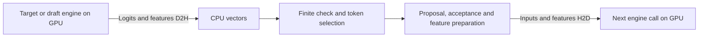

# Reducing speculative runtime host overhead

The prototype uses host vectors to connect model execution, token selection
and EAGLE3 conditioning. This made state transitions easy to inspect, but it
serializes CPU work with short GPU executions. Neither the compiler-runtime
KV contract nor the attention lowering requires these host round trips.

The [graph profile](SPECULATIVE_GRAPH_PROFILE.md) measured approximately
270 ms/request with no GPU activity in MC, versus 8 ms in Edge. Its largest
component was an accidental allocation in validation, not useful model work.

## Implemented: avoid allocating an error message for every logit

`argmax` formerly passed a string literal to `require(bool, const std::string&)`
for every value. A temporary string was constructed before `require` could
check the condition. This request scanned 19.6 million values, and its
17-character error message allocated heap storage in the measured binary.

The runtime now constructs the message only after detecting a non-finite value.
It still checks every logit and retains the same exception and first-index
argmax tie behavior. No engine rebuild, state ABI change, plugin dependency or
GPU kernel change is needed. Regression cases cover NaN and both infinities
at different positions, tied maxima, signed zero, negative logits, a single
value, and empty ranges.

The preceding controlled diagnostic measured finite-scan time dropping from
about 200 to 10 ms/request, and native request latency from 512 to 337 ms.
Those numbers belong to the diagnostic experiment; production validation is
recorded below separately.

## Why overhead remains

[Engine::run](runtime/speculative/engine.cpp) accepts CPU vectors, builds the
visibility mask and positions, uploads inputs, copies logits and features back
into CPU vectors, and synchronizes. [Eagle3](runtime/speculative/eagle3.cpp)
slices and repackages those features for the next call. The target and draft
repeat this exchange 127 times per request on the profiled chain fixture.

After removing the allocation, the profile still shows approximately 10 ms
finite checking, 20 ms max-element scanning, and 51 ms other GPU-idle time.
The latter includes preparation, allocations, host feature copies and gaps
around enqueue/readback. Not every remaining CPU gap has been isolated.

The 116 MB D2H and 58 MB H2D transfers add about 10.5 ms of actual GPU copy time.
Pageable `cudaMemcpyAsync` calls also block while preceding GPU work completes.
Their CPU API duration therefore includes GPU execution; it must not be counted
again as transfer overhead or added to the GPU-idle measurements.

## Follow-up scope: device-resident features and greedy selection

These changes were not implemented by the allocation fix measured in this note.
The subsequent [resident runtime](SPECULATIVE_RESIDENT_RUNTIME.md) implements
device feature transport, an optional TensorRT selector and reusable buffers.
CUDA graph replay remains future work. The original plan was:

1. Keep target and recurrent draft features on the GPU. Replace host feature
   vectors in the family runtime's step result with device storage/views and
   perform feature slicing/gathering on device. Existing `device_ptr`,
   `bind_external` and `forward_device_async` provide the underlying mechanisms.
   Preserve the conditioning tensor shapes and semantics for both attention
   backends.
2. Reduce logits to selected token IDs on device for greedy execution, with
   finite-value status per row. TensorRT graph primitives are a candidate lowering;
   any helper-kernel alternative must preserve the same selection semantics.
   Return compact decisions instead of full vocabulary rows. Make compact
   outputs an explicit optional engine capability and retain the full-logits
   path for old bundles and techniques that need distributions. Five target
   rows currently return 2,565,120 bytes of FP32 logits; five token IDs occupy
   20 bytes, plus the validation status.
3. Reuse input, mask and staging buffers. Generate large visibility tensors on
   device where appropriate; reserve pinned host storage for small control
   transfers that still cross the boundary.
4. Once addresses and stream dependencies are stable, evaluate CUDA graph replay.
   Replay alone does not remove CPU selection or feature round trips.

The host can continue to own policy and logical committed lengths. GPU-resident
data does not require putting every speculative technique into one opaque
attention plugin. Feature conditioning remains EAGLE3-owned, while resident
tensor transport and token-selection semantics can serve other techniques.

### Binding and lifetime requirements

The additional runtime contract concerns ordinary model input/output buffers:

- An output view is valid only until its producer's next overwrite or reset.
  Draft recurrence needs an explicit retained copy or separate input/output
  buffers; blindly binding a draft output as its next input risks unsupported
  aliasing during execution.
- The consumer must wait for the producer's GPU work. Use ordered execution on
  one stream or explicit events across target/draft streams. Do not replace a
  host synchronization with an unguarded cross-stream pointer handoff.
- Record device, dtype, logical shape, ownership and readiness for a borrowed
  tensor. Distinguish its lifetime from persistent KV storage.
- Keep first-index tie breaking and non-finite rejection explicit when moving
  greedy selection to a graph or helper kernel.

These requirements preserve the existing KV read/write, mask visibility,
commit and paging semantics. Compact token outputs would extend the model I/O
capabilities; GPU feature residency itself does not require a new KV layout.

The next performance claim should be based on a separate comparison that checks
AR, chain, tree, reset/reuse and short prompts against the existing references.
Removing the remaining idle time is an opportunity, not a promised latency.

## Production validation and performance

The allocation fix was built with attention plugins enabled and disabled. Both
C++ policy/argmax test runs and the formatting check passed. The tested source
hashes match the main repository. There is no importable Edge Python package
in the MC build environment.

Both attention backends passed the full-model AR/chain/tree comparison against
the independent Edge reference, reset checks and short-prompt consistency checks.
All 104 warm-up and timed benchmark requests matched the same 101 output IDs.
The full-model GPU checks used the plugin-enabled binary for both backends;
the plugin-disabled build was separately compiled and policy-tested.

Fresh medians on GB100/SM100 on September 22, 2026, IST=1024, 101 generated IDs,
FP16/B1/TP1, split profiles with 1024-token prefill, CUDA graphs off:

| Backend | AR, ms | EAGLE3 chain, ms | EAGLE3 tree, ms |
|---|---:|---:|---:|
| MC native primitives | 782.71 | **332.56** | 362.35 |
| MC XQA plugin | 858.34 | **377.34** | 404.44 |
| Edge-LLM | 604.02 | **244.16** | Not measured |

Each mode has three warm-ups and ten timed requests. The existing harness rotates
mode order. All backends run sequentially on one GPU and reuse the existing
engines; no engine was rebuilt. Request times include prefill and reset, and
exclude loading. MC chain still uses 26 verification rounds and Edge uses 25.
Chain min/max were 328.70–333.89 ms native, 375.81–378.37 ms plugin and
241.21–246.41 ms Edge. Clocks were not locked or changed.

This is a different allocation from the diagnostic experiment. Use that earlier
controlled comparison for the fix's before/after speedup; this table reports
fresh production behavior. It remains a single high-acceptance fixture, with
the numerical/generalization limits documented in the graph-profile report.

Raw JSON, build/test logs, scripts, source patch, source/binary hashes and
telemetry are retained in `/home/trentl/Working/specdecode-host-overhead/`.
Its README gives the exact commands and pinned remote engine locations.
