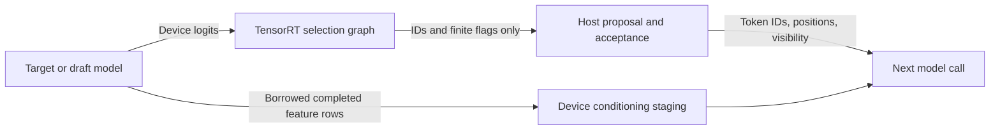

# Device-resident speculative runtime

The runtime retains target and draft features on the GPU and reuses conditioning,
prompt, mask and cache-compaction storage. An optional TensorRT selection engine
reduces full-vocabulary logits to compact greedy decisions. Neither change alters
the attention/KV ABI or requires an Edge-LLM package or a custom selection kernel.

## Compiler/runtime boundary

Build with `--greedy-selection device_v1` on the existing `llama build-speculative`
command. The default `host` retains full-logit CPU selection; old manifests missing
this field retain that behavior. Features use device transport in either mode.
Both attention backends and both execution-profile configurations are supported.

Each engine contract records `greedy_selection`. `device_v1` requires a matching
`target_selection.plan` or `draft_selection.plan` bundle section. These are small,
stateless TensorRT graphs. The model plans still output their original logits
and features; their state bindings and alias guarantees are unchanged. The
selector can therefore be compiled independently without retuning a model plan.
An older runtime does not implement this optional capability; use the updated
runtime to enable it.

| Selector binding | Type/shape | Meaning |
|---|---|---|
| `logits` | input FP32 `[M,V]` | Borrowed device output of the model, in selected query-row order. |
| `selection` (target) | output INT32 `[M,2]` | Best vocabulary index, then an all-finite flag. |
| `selection` (draft) | output INT32 `[M,3]` | Best and second-best distinct vocabulary indices, then an all-finite flag. |

The selector has one dynamic row profile, MIN=1, OPT=min(5, MAX), and MAX equal
to the largest selected-logit bound in the model profiles (legacy: `max_query`).
It never writes logits, features or KV state. IDs remain in the model's vocabulary;
EAGLE3 owns the draft-to-target vocabulary mapping.

Selection is descending by value, with lowest vocabulary index first on ties,
including signed zero. MAX, equality, integer MIN and select graph operations
make the tie rule explicit. The second rank excludes the first selected index.
`abs(logit) < infinity`, cast and MIN reduction produce a per-row all-finite flag.
NaN and either infinity make the flag zero; IDs on such rows are unspecified.
The runtime rejects a non-finite row when the policy consumes it, as the host
implementation does. Unvisited verification branches need not be consumed.
This is greedy selection, not a probability/sampling contract. Full logits and
the host path remain available for future techniques that need distributions.

## Buffer ownership and ordering

- `Engine::run` returns a completed `FeatureView`: FP16, dense rows on the current
  execution device. It owns no storage and expires at the producer's next run,
  reset or destruction. It is ordinary model data, not persistent KV state.
- Draft conditioning is copied or gathered into reusable input buffers on the
  draft stream before enqueue. Recurrence copies the last output row before
  that output can be overwritten. Empty conditioning means explicit zeros.
- Prompt accumulation uses independent pipeline-owned device storage, so later
  target prefill chunks cannot invalidate earlier feature rows. Its stream is
  synchronized once before draft prefill reads the accumulated prompt.
- The selector binds the model's device logits directly. An event recorded after
  model enqueue and waited on by the selector orders different streams. A final
  checked selector-stream synchronization completes both model outputs and the
  compact readback. Host selection also synchronizes before returning a view.
- Compact readback uses reusable pinned memory. Input preparation and policy
  still execute on the host, and each model step still ends at a host decision.
  This change does not implement an asynchronous scheduler or CUDA graph replay.

The separation allows a future fused model-output selection graph without
changing KV semantics. Such fusion would rebuild model engines and needs its own
performance and parity comparison; it is not required for this implementation.

## Validation and performance

GB100/SM100 measurements on September 22, 2026, TensorRT 11.1.0.106, FP16/B1/TP1,
IST=1024, 101 generated IDs, split1024 profiles, CUDA graphs off. Each mode has
three warm-ups and ten timed requests, rotating AR/chain/tree order. Loading is
excluded; prefill, reset and decoding are included. All variants run sequentially
on one GPU. Model-plan section hashes are identical before and after augmentation.

| Runtime | AR median, ms | EAGLE3 chain median, ms | EAGLE3 tree median, ms |
|---|---:|---:|---:|
| Previous MC OOTB, allocation fix included | 787.10 | 330.41 | 360.01 |
| MC OOTB, device features + host selection | 780.10 | 306.31 | 338.13 |
| MC OOTB, device features + GPU selection | **758.90** | **282.34** | **292.63** |
| Previous MC plugin, allocation fix included | 847.11 | 369.18 | 395.22 |
| MC plugin, device features + host selection | 842.83 | 342.92 | 372.37 |
| MC plugin, device features + GPU selection | **831.45** | **310.58** | **325.00** |
| Edge-LLM | 588.69 | 238.28 | Not measured |

Chain latency falls 14.5% for OOTB and 15.9% for the plugin. Tree latency falls
18.7% and 17.8%. The feature-transport ablation also includes buffer reuse; it
does not isolate each allocation or copy independently. MC chain still takes
26 verification rounds, MC tree 25, and Edge chain 25. Acceptance lengths match
the prior MC runtime exactly.

All 260 benchmark requests (warm-ups included) matched the independent Edge
reference. Both attention backends passed AR/chain/tree, reset and short-prompt
checks with GPU selection and with the legacy host-selection bundles. A separate
native-only binary passed full-model checks with the resident OOTB bundle. A
split64 bundle additionally exercised feature accumulation across prefill chunks.
All full-prompt checks matched the same 101 reference IDs.

Both plugin-enabled and plugin-disabled builds and C++ policy tests passed.
The 13 Python contract tests, clang-format and Ruff checks passed. The numerical
probe, `python -m families.llama.tests.selection_gpu`, passed 168 cases against
independent stable NumPy sorting: full target/draft vocabulary sizes, a two-token
vocabulary, ties, signed zero, float32 extremes, NaNs, infinities and changing
row counts. Policy tests cover consumed versus unused invalid rows, host/device
rank interpretation, manifest compatibility and feature-view bounds. Tested
source hashes match the main repository.

Clocks were not locked. OOTB chain ranges were 328.48–348.95 ms before and
280.19–285.23 ms after; plugin ranges were 367.55–370.14 and 308.57–325.34 ms.
Edge ranged 236.48–254.59 ms. Medians describe this run, not a universal speedup.
An adjacent plugin repeat during the PDL experiment below measured 322.90 ms
for chain, illustrating roughly 4% variation from the initial resident median.
This remains one high-acceptance fixture; the numerical/generalization limits in
the [earlier graph profile](SPECULATIVE_GRAPH_PROFILE.md) still apply.

Scripts, raw outputs, plan/source/binary hashes, linkage checks, telemetry and
Nsight captures are retained in `/home/trentl/Working/specdecode-resident-runtime/`.
Its README records the exact commands and remote bundle locations.

## Where the remaining time goes

Separate Nsight Systems captures contain three warm EAGLE3 chain requests per
variant. These are trace means, not the unprofiled medians above. GPU busy time
is the union of kernel, copy and memset intervals within each request; idle time
is the remainder of the request. Idle includes host policy, submission and
synchronization gaps, rather than measuring CPU computation alone.

| Runtime | Traced wall, ms | GPU busy, ms | GPU idle, ms | Kernel calls/request |
|---|---:|---:|---:|---:|
| Previous MC OOTB | 336.36 | 256.63 | 79.72 | 15,699 |
| Resident MC OOTB | 290.38 | 273.74 | 16.65 | 16,534 |
| Previous MC plugin | 374.52 | 295.17 | 79.35 | 15,143 |
| Resident MC plugin | 316.11 | 297.91 | 18.20 | 15,978 |
| Edge-LLM | 243.69 | 236.12 | 7.57 | 12,063 |

The first OOTB request's device-to-host traffic drops from 116,022,272 bytes
across 254 copies to **2,216 bytes across 127 copies**. Feature round trips are
gone; only IDs and finite flags return. Host-to-device traffic falls from
58,470,620 to 19,247,324 bytes. It still includes dense visibility masks and
control inputs. Nsight flags their pageable uploads and the remaining host
synchronization; two 8.389 MB prefill-mask uploads are the largest transfers.

The standalone selector introduces 835 kernel calls per chain request: five
per target call and seven per draft call. Its reduction cost is traded against
much larger transfer and CPU-scan costs. Model kernel durations also vary across
these captures, so the change in aggregate GPU time cannot all be attributed to
selection. Clocks are unlocked and the GPU duty cycle changes with the runtime.

Edge's summed kernel time is 275.24 ms, but its kernel interval union is only
235.74 ms. The corresponding OOTB figures are 276.66 and 271.21 ms; plugin figures
are 299.74 and 295.13 ms. Most of Edge's extra overlap is on the same CUDA stream,
including attention and subsequent GEMMs. Auxiliary streams alone do not
explain it. Summed kernel durations and CPU wait durations must not be added to
estimate request latency.

### PDL experiment: measured, not adopted

An isolated plugin build changed only `ENABLE_PDL` from 0 to 1 in `xqa.cu`.
It retained the ordinary kernel launch, preserving predecessor completion before
attention reads inputs. The donor's outgoing programmatic launch signal can let
a PDL-capable successor launch early; that successor must wait before consuming
results. This follows the [CUDA PDL contract](https://docs.nvidia.com/cuda/cuda-programming-guide/04-special-topics/programmatic-dependent-launch.html).
The attention fallback reads state before the donor's internal dependency wait,
so enabling early *incoming* launch would require a separate ordering audit.

All ten attention GPU contract cases and full-model Edge/reset/short-prompt
checks passed. Three warm-ups and ten measurements per mode, followed by an
adjacent repeat with the original plugin binary restored, produced:

| Plugin build | AR median, ms | Chain median, ms | Tree median, ms |
|---|---:|---:|---:|
| PDL enabled | 845.29 | 322.63 | 336.63 |
| Original restored | 845.75 | 322.90 | 338.35 |

Both sets of 39 requests matched the Edge IDs and prior acceptance paths. There
is no convincing latency benefit in this experiment. Comparing PDL only with
the earlier 310.58 ms resident run would incorrectly suggest a regression.

PDL does increase overlap: its trace has 365.65 ms summed kernel time versus
310.19 ms kernel interval union. But the largest overlapping pair is attention
and MC's transpose (41.12 ms in the first request), whereas Edge's largest pair
is attention and a GEMM (20.46 ms). An overlapping kernel may spend time waiting;
timeline overlap does not prove useful concurrent computation. The unchanged
latency motivates examining layout conversions and the compiled dependency
chain. Production retains `ENABLE_PDL=0`; original source and binary hashes were
verified after restoration. The experiment scripts and traces are retained.

### Next optimization targets

Next work should address three separate costs:

1. Reduce GPU execution time by comparing attention/GEMM lowering and scheduling
   on the critical path. Aggregate overlap is descriptive, not a recoverable
   latency estimate; each scheduling change needs an end-to-end measurement.
2. Fuse selection with the model output graph or reduce its launches while
   preserving stable ties and per-row finite checks. The separate selector is
   intentionally replaceable without changing the KV contract.
3. Reduce dense mask/control uploads and repeated shape/binding submission, then
   evaluate graph replay. About 9–11 ms of excess idle time remains against Edge
   in these traces. Removing it alone would not close the GPU execution gap.
